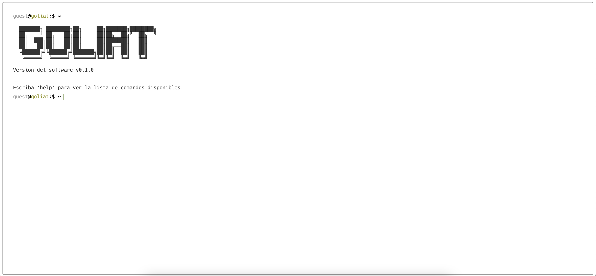

# [💻 Goliat - Web con estilo de terminal en minutos!](https://terminal.danieljsaldaña.com)

Plantilla de sitio web con estilo de terminal minimalista, altamente personalizable y fácil de usar, con tecnología de Next.js.

Crear un sitio web simple con LiveTerm solo toma **minutos** y solo necesita trabajar con **un** archivo: `config.json`. Después de clonar este repositorio, simplemente ejecute `yarn install && yarn dev` y comience a editar `config.json` para crear su sitio web.

LiveTerm can be used to build a variety of websites:

- [Daniel J. Saldaña - Terminal](https://terminal.danieljsaldaña.com)

¡Siéntete libre de jugar con la demostración web de arriba!

## 📸 Showcase

<p align="center">
<br>
</p>

<p align="center">
<br>
<strong><a href="https://terminal.danieljsaldaña.com" target=_blank>Daniel J. Saldaña - Terminal</a></strong>
</p>

## 🚀 Despliega su sitio Goliat en menos de 5 minutos

Goliat requiere el administrador de paquetes `yarn`. Puede instalar `yarn` [aquí](https://classic.yarnpkg.com/lang/en/docs/install/).

Simplemente ejecute el siguiente comando en su terminal:

```bash
sh -c "$(curl -fsSL https://raw.github.com/danieljesussp/danieljsaldana-terminal/blob/main/install/install.sh)"
```

Esto instalará Goliat en el directorio actual. Puedes comenzar a construir tu sitio web con:

```bash
cd danieljsaldana-terminal && yarn dev
```

¡Comience a editar `config.json` e intente guardar y ver los cambios actualizados!

Alternativamente, puede clonar este repositorio en una ubicación de su elección.

```bash
git clone https://github.com/danieljesussp/danieljsaldana-terminal.git && cd danieljsaldana-terminal
```

Luego instale las dependencias y comience a desarrollar allí:

```bash
yarn install && yarn dev
```

### Docker

Primero, clone el proyecto y edite `config.json` a su gusto. Luego ejecute lo siguiente para iniciar el contenedor en segundo plano:

```shell
docker-compose up -d
```

## 📄 Configuración

### Configuracion basica

El 90 % de las configuraciones de Goliat se realizan a través del archivo `config.json`.

```javascript
{
  "changelog": 
  "title": 
  "name": 
  "biografia": "",
  "experiencia": "",
  "habilidades": "",
  "skills": "",
  "contacto": "",  
  "social": {
    "github": 
    "linkedin": 
    "instagram": 
    "unsplash":
  },
  "email": 
  "ps1_hostname": "goliat" 
  "ps1_username": "guest", 
  "resume_url": "W", 
  "non_terminal_url": "W",
  "colors": {
    "light": {
      ...
    },
    "dark": {
      ... 
    }
  }
}
```

¡Siéntete libre de cambiarlo como mejor te parezca!

### Favicons

Los Favicons se encuentran en `público/`, junto con otros archivos que quizás desee cargar en su sitio web. Usé este [sitio web](https://www.favicon-generator.org/) para generar favicons.

### Banner

También puede cambiar la salida del comando `banner`. Para hacer eso, simplemente pegue su banner generado en `src/utils/bin/commands.ts`. Usé este [sitio web](https://manytools.org/hacker-tools/ascii-banner) para generar mi banner.

### Configuración avanzada

Si desea personalizar aún más su página, ¡siéntase libre de cambiar el código fuente a su gusto!

## Creditos

- Basado en LiveTerm [LiveTerm](https://github.com/Cveinnt/LiveTerm).
- Basado en M4TT72 [Terminal](https://github.com/m4tt72/terminal).
